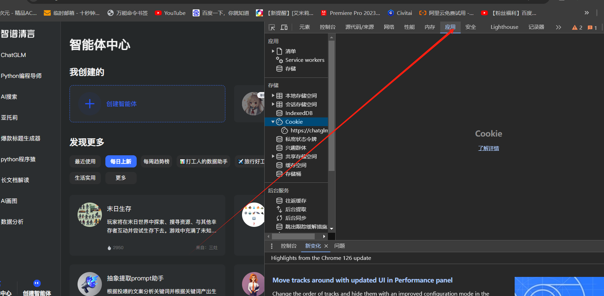
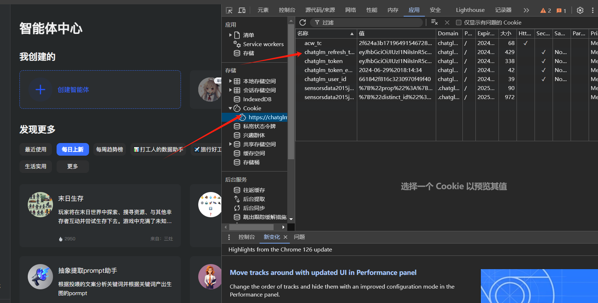
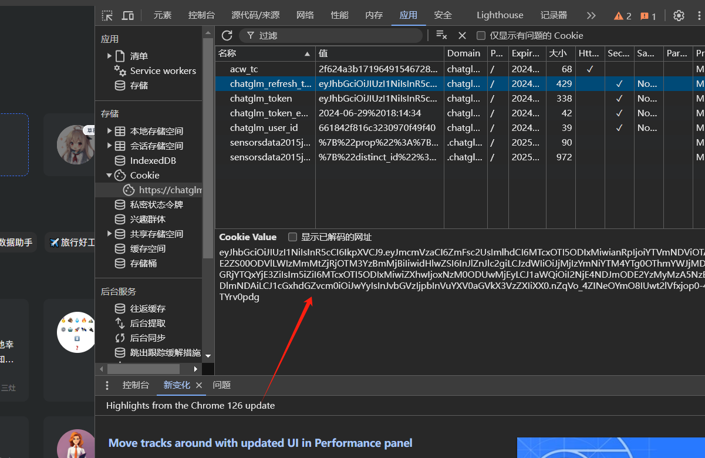

# 包名称

chat

## 简介

用selenium库实现免ap调用集成大语言模型聊天（目前有智谱清言和kimi），额外包括我用来角色扮演用的三种翻译api调用函数

## 环境
- python 3.10（我用的版本，其他版本没测试）
- 谷歌浏览器  （其他浏览器需要自行改代码）

## 安装

下载后运行安装依赖.bat或者在命令行安装依赖：

```bash
pip install -r requirements.txt
```
然后把包chat放在你的py文件的根目录即可正常导入函数。
## 使用示例
智谱清言模型调用示例调用示例见test1.py：
```bash
from chat.utils import talk
from chat.utils import click_create_text_element
from chat.utils import send_and_update

OPTIONS = True  
#是否开启无头模式，即不打开网页，或者 False打开网页

TOKEN = ''

#这个是你自己本地谷歌浏览器保存的token，是长期的。过期需要重新登录获得。


def test(driver):

    while True:
        try:
            # 获取用户输入
            message = input("请输入消息（输入'退出'结束程序）: ")

            if message == "退出":
                print("程序结束。")
                break  # 退出循环

            if message == "新建对话":
                click_create_text_element(driver)
                continue  # 跳过循环的剩余部分，直接回到循环的开始
            
            # 调用 send_and_update 函数
            element_text = send_and_update(driver, message)
            
            # 打印返回的清洗后的元素文本
            if element_text:  # 检查 element_text 是否为 None 或其他无效值
                print(element_text)
                message = "" 

        except Exception as e:
            print(f"发生错误：{e}")
            driver.quit()  # 发生异常时关闭浏览器
            break  # 退出循环

    # 如果程序正常结束循环，也关闭浏览器
    driver.quit()

driver = talk(OPTIONS, TOKEN)
test(driver)
```
获取token方式获取如下：
- 下载好谷歌浏览器后打开智谱清言https://chatglm.cn
- 然后登录账号
- 右键点击检查或者按F12打开开发者工具：<br>
  
- 点开上方的“应用”然后左侧边栏的“存储”菜单下点开“Cookie”:<br>
  
- 然后在右边找到chatglm_refresh_token的值填入代码中即可，过期后需重新获取<br>:<br>
  

kimi网站 https://kimi.moonshot.cn kimi模型函数调用示例见test2.py：
```bash
from chat.kimi import kimisend_and_update
from chat.kimi import kimiclick_create_text_element
from chat.kimi import kimitalk

#kimi的cookie是动态的，只能每次打开都手动登录了，也不能无头模式聊天了

def test(driver):

    while True:
        try:
            # 获取用户输入
            message = input("请输入消息（输入'退出'结束程序）: ")

            if message == "退出":
                print("程序结束。")
                break  # 退出循环

            if message == "新建对话":
                kimiclick_create_text_element(driver)
                continue  # 跳过循环的剩余部分，直接回到循环的开始
            
            # 调用 send_and_update 函数
            element_text = kimisend_and_update(driver, message)
            
            # 打印返回的清洗后的元素文本
            if element_text:  # 检查 element_text 是否为 None 或其他无效值
                print(element_text)
                message = "" 

        except Exception as e:
            print(f"发生错误：{e}")
            driver.quit()  # 发生异常时关闭浏览器
            break  # 退出循环

    # 如果程序正常结束循环，也关闭浏览器
    driver.quit()

driver = kimitalk()
test(driver)
```
kimi的cookie是动态的，我不知道怎么解决，只能每次都网页打开都手动登录了  
翻译api有三种，百度机翻，谷歌机翻和百度ai翻译，怎么获取api请自行百度 函数调用示例见test0.py：
```bash
from chat.baidu import translate_ja_to_zh
from chat.baidut import translate_text
from chat.tenxun import txtra


TXSecretId = ''
TXSecretKey = ''
TXS = "ja"
TXT = "zh"
#TXSecretId和TXSecretKey是腾讯云机翻的一对api密钥，填写你自己的
#TXS是待翻译的语种
#TXT是翻译的目标语种

APPID = 
SECRET = ''
BDTS = "jp"
BDTT = "zh"
#APPID 和SECRET是百度机翻的appid和密钥，填写你自己的
#BDTS是待翻译的语种
#BDTT是翻译的目标语种


BDaccess_token = ''
BDS = "jp"
BDT = "zh"
#BDaccess_token是百度ai翻译的访问tooken，填写你自己的，这个不是机翻，是百度ai开放平台的ai翻译，1年内免费500w字符，质量略高
#BDS是待翻译的语种
#BDT是翻译的目标语种


out = "よかった。何かレムにお手伝いできることがあれば、いつでも言ってください。レムはいつでもあなたの味方です。"
out1 = translate_ja_to_zh(out, BDaccess_token, BDS, BDT)
print("百度AI翻译：", out1)
out2 = txtra(out, TXSecretId, TXSecretKey, TXS, TXT)
print("腾讯机翻：", out2)
out3 = translate_text(out, APPID, SECRET, BDTS, BDTT)
print ("百度机翻：", out3)
```
